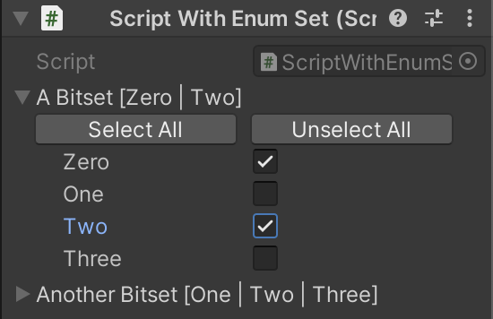

# EnumBitSet
A memory efficient `ISet` for enums that store data using bit masks for C#.

Current implementations:
- `EnumBitSet32<T>`: uses `int` as data, supporting enums with up to 32 values.
- `EnumBitSet64<T>`: uses `long` as data, supporting enums with up to 64 values.

## Unity Property Drawer
In Unity, there's a custom property drawer for selecting the containing enums:

```cs
using EnumBitSet;
using UnityEngine;

public class ScriptWithEnumSet : MonoBehaviour
{
    public enum TestEnum
    {
        Zero, One, Two, Three
    }

    public EnumBitSet32<TestEnum> aBitset;
    public EnumBitSet64<TestEnum> anotherBitset;
}
```

